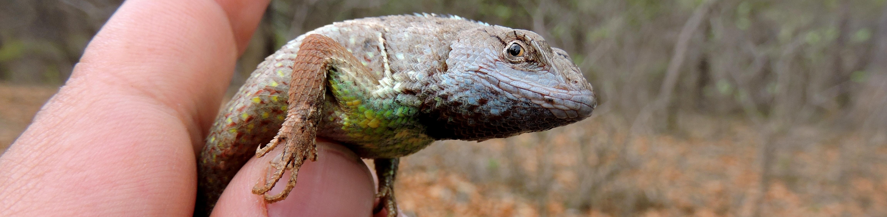

# Objetivos {-}

------

* Comprender las bases teóricas para el cálculo de similitudes de la estructura de la comunidad entre localidades.

* Utilizar herramientas de análisis para calcular índices de similitud y distancias entre comunidades.
 
 
